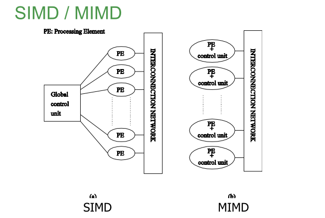

# 6.1 基础知识

## 6.1.1 并行计算

* 并行地使用多种计算资源解决问题的过程，提高计算机系统的**计算速度**和**处理能力**的一种手段。
* 基本思想是使用多个处理器协同地解决同一个问题。需要将大问题分解为小问题，每个小问题都用一个独立的处理机计算，实现并行。
* 并行计算系统可以是**超级计算机**（含有多个处理器），也可以是**集群**（含有多个计算机）。

## 6.1.2 线程与进程的区别与联系

* 并发性：（相同）线程与进程都可以并行地执行任务。
* 调度：（不同）在传统的OS中，进程是分派和调度的基本单位；在现代的OS中，进程则成为了系统**分配资源**的基本单位，**分派和调度**的基本单位是线程，因此同一进程中线程的切换不会引起进程的切换。
* 系统开销：（不同）进程在创建和销毁时需要分配和回收资源，线程则不用。除此之外，还需要在保存或设置与进程相关的CPU的环境状态。在一些系统中，线程在同步、切换、通信时不需要操作系统内核的干预。但在不同进程中的线程之间进行切换时也需要保存CPU环境状态。
* 拥有资源：（不同）进程是系统分配资源的基本单位，线程自己不拥有系统资源，但同一个进程中的线程可以共享该进程中的资源。

## 6.1.3 PCAM设计方法学

* 四个部分
  * 划分(Partition): 将大任务分解成若干小任务，开拓出并发性。
  * 通讯(Communication): 确定各个小任务之间的数据交换，检验划分的合理性。
  * 组合(Agglomeration): 根据任务的局部性，组合成更大的任务。
  * 映射(Mapping): 将每个任务分配到处理器上。

* 划分技术
  * 域分解：划分的对象是**数据**。数据可以是：输入数据、中间数据、输出数据。分解的原则是将大数据分成大致相等的小数据。如果小任务之间存在着数据依赖，则会产生任务之间的通信开销。
  * 功能分解：划分的对象是**计算**。划分后，如果不同任务之间所需要的数据是不相交的，则说明划分成功。否则如果对于数据来说有大量的重叠，则需要重新进行域分解与功能分解。

## 6.1.4 单指令流与多指令流的区别

指令是由控制单元给出的，如果在每个处理单元中都有专门的控制单元，则为Multi-Instruction类型。

## 6.1.5 Cache一致性

* 一致性问题的产生
  * 内存系统提供存储单元，当读一个存储单元时，返回的是对该存储单元“最近”写入的值，内存系统的这一基本性质适用于串行、并行系统。

  * 一个读操作返回的是对该存储单元“最近”写入的值，而不区分到底是哪个线程写的。当所有的线程运行在同一个物理处理器上时，它们通过相同的Cache层次来看内存，因此在这种情况下不会出现问题。

  * 而对于共享存储的多处理器系统，假如有两个进程，运行在不同的物理处理器上，它们通过不同的Cache层次来看共享内存时，其中一个进程可能会看到在它的Cache中的新值，而另一个则可能会看到旧值，这样就引起了Cache一致性问题。

* 解决方法——MESI协议: 标识Cache行所处的不同的状态
  * Modified: 该行数据因为被修改了，所以**与内存中数据不一致**，且数据仅在本Cache中。此行数据**有效**。
  * Exclusive: 该行数据**与内存中数据一致**，且数据仅在本Cache中。此行数据**有效**。
  * Shared: 该行数据与**内存中数据一致**，且数据被多个Cache所共享。此行数据**有效**。
  * Invalid: 此行数据**无效**。

## 6.1.6 假共享

* 在SMP系统中，每个处理器均有一个Cache。假共享是SMP系统上的常见性能问题。当不同处理器上的线程修改驻留在同一Cache行中的变量时就会发生假共享，因为每个线程并非真正共享相同变量的访问权。

* 每个处理器上都有某种形式的内存或Cache,共享数据一般都是复制到使用它们的处理器的内存或Cache中。这种复制进行的时候，返回的是对该存储单元“最近”写入的值。

* 一致性协议不区分块内的各个字；对块内任何一个字的写入都会导致整个块的所有副本失效或更新。因此，不同的处理器对一个块内不相干的字集的引用有可能导致对程序的正确行为不需要的一致性操作，这就是假共享。

## 6.1.7 Amdahl定律

* 对于打算以并行实现的程序而言，在进行划分时，存在着不可并行部分与并行部分。假设并行资源足够充足，即并行部分执行的时间无限接近于0。不可并行部分限制着整体性能的提升。而且，划分得不够均匀使得真正运行的时间要小于理想状态下的并行运行时间。

## 6.1.8 实现负载均衡的方法

* 静态：事先确定好
* 动态：执行期间动态确定
* 概率：随机确定
* 域分解：局部算法、概率方法、循环映射、递归对剖

## 6.1.9 MPI通信方式

* 标准通信方式：发送操作**无需**确保是否能正常接收就可以发送；发送操作**无需**等待接收端的确认就可以正确返回。
* 同步通信方式：发送操作**无需**确保是否能正常接收就可以发送；发送操作**需要**等待接收端的确认才可以正确返回。
* 就绪通信方式：发送操作**需要**确保能正常接收才可以发送。
* 缓存通信方式：由用户直接对通信缓存区进行`申请`、`使用`、`释放`。
